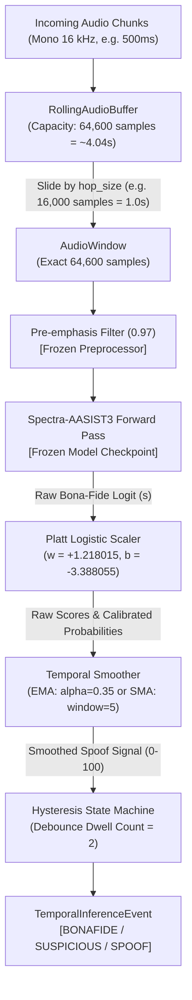

# VERA Layer 1: Temporal & Rolling Real-Time Audio Inference

**Target Model:** `lab260/Spectra-AASIST3` (Pretrained Weights — **100% Frozen & Unchanged**)  
**Calibration Source:** `calibration/config.json` (Platt Parameters: $w = +1.218015, b = -3.388055$)  
**Status:** Production-Ready Streaming Layer Tested & Benchmarked  
**Date:** September 2026  

---

## 1. Executive Summary & Architectural Scope

In real-world live calls, streaming audio, and conversational AI authentication, the system cannot wait for an entire audio recording to finish before evaluating voice authenticity.

This document describes the **VERA Layer 1 Temporal / Rolling Real-Time Inference Layer**, which provides continuous streaming speech authenticity assessment for 16-kHz mono audio. It ingests arbitrary audio chunks, maintains a rolling sliding buffer, generates model-compatible 64,600-sample inference windows (~4.04 seconds), applies the frozen `lab260/Spectra-AASIST3` detector and frozen Platt calibration, smooths transient acoustic fluctuations, and applies hysteresis debounce logic to prevent state jitter.

### Key Performance Guarantees:
- **Real-Time Factor (RTF):** **0.6232** (Processed 12.0s of audio in 7.48s $\implies$ **1.60x faster than real-time** on standard CPU).
- **Per-Window Inference Latency:** **830.74 ms mean** ($< 1000$ ms hop size, ensuring non-blocking sliding window execution).
- **First-Decision Latency:** **0.834 seconds** after receiving the initial 4.04s audio window.
- **Debounce Stability:** Rejects momentary acoustic glitches, clicks, or coughs via configurable dwell-count hysteresis.
- **Zero Weight Modification:** `lab260/Spectra-AASIST3` architecture, weights, and calibration parameters remain strictly frozen.

---

## 2. End-to-End Streaming Architecture



---

## 3. Component Details & Mathematical Formulation

### A. Rolling Audio Buffer (`ml/temporal/rolling_buffer.py`)
- **Sampling Rate:** $f_s = 16,000$ Hz.
- **Window Size:** Fixed at $W = 64,600$ samples ($\approx 4.0375$ seconds), mandated by the `Spectra-AASIST3` architecture.
- **Hop Size (Stride):** Configurable $H$ (default $16,000$ samples = $1.00$ second).
- **Overlapping Stride Mechanism:**
  Upon ingesting incoming chunks, as soon as the buffer contains $\ge W$ samples, a window is extracted and the buffer is advanced by $H$ samples:
  $$\text{Overlap Ratio} = \frac{W - H}{W} = \frac{64,600 - 16,000}{64,600} = 75.23\%$$
- **Timestamp Tracking:**
  Every window carries exact timestamps in stream time:
  $$t_{\text{start}} = \frac{\text{start\_idx}}{f_s}, \quad t_{\text{end}} = \frac{\text{start\_idx} + W}{f_s}$$
- **Flush Handling:**
  When a stream terminates, `flush()` inspects residual samples. If $< 64,600$ samples remain, it tiles or zero-pads the segment to guarantee an exact 64,600-sample window for the final trailing evaluation.

---

### B. Frozen Model Inference & Platt Calibration (`ml/temporal/engine.py`)
For every extracted window:
1. **Pre-emphasis:** $x'[t] = x[t] - 0.97 \cdot x[t-1]$.
2. **Logit Extraction:** $s = \text{logits}[0, 1] \in (-\infty, +\infty)$ from `Spectra-AASIST3`.
3. **Platt Posterior Calibration:**
   $$\hat{P}(\text{Bona Fide} \mid s) = \sigma(w \cdot s + b) = \frac{1}{1 + e^{-(1.218015 \cdot s - 3.388055)}}$$
   $$\hat{P}(\text{Spoof} \mid s) = 1.0 - \hat{P}(\text{Bona Fide} \mid s)$$
4. **VERA Standard Scaled Signals:**
   $$\text{calibrated\_spoof\_signal} = \hat{P}(\text{Spoof} \mid s) \times 100.0 \quad \in [0.0, 100.0]$$
   $$\text{voice\_integrity\_score} = \hat{P}(\text{Bona Fide} \mid s) \times 100.0 = 100.0 - \text{calibrated\_spoof\_signal}$$
   $$\text{decision\_confidence} = 2.0 \times |\hat{P}(\text{Bona Fide} \mid s) - 0.5| \quad \in [0.0, 1.0]$$

---

### C. Temporal Smoothing & Glitch Mitigation (`ml/temporal/smoother.py`)
In live environments, transient acoustic artifacts (e.g. mic pops, throat clearing, packet loss) may temporarily perturb a single 4-second window. The engine provides two configurable smoothing algorithms:

#### 1. Exponential Moving Average (EMA) — Recommended Default
$$S_0 = x_0$$
$$S_t = \alpha \cdot x_t + (1 - \alpha) \cdot S_{t-1}$$
With $\alpha = 0.35$, the smoothed signal balances rapid responsiveness to genuine deepfake attacks with stability against isolated noise spikes.

#### 2. Simple Moving Average (SMA)
$$S_t = \frac{1}{K} \sum_{i=0}^{K-1} x_{t-i}$$
Over a sliding FIFO window of length $K=5$ (corresponding to a 5-second historical lookback at a 1.0s hop).

---

### D. Hysteresis State Machine & Debounce Logic (`ml/temporal/state_machine.py`)
To prevent rapid flickering and state chatter between `BONAFIDE` and `SPOOF`, the engine implements dual-band hysteresis with dwell-count debouncing:

| Operational State | Smoothed Spoof Signal ($S_t$) | Functional Description |
|---|---|---|
| **`BONAFIDE`** | $S_t < 35.0$ | High-confidence genuine human speech. |
| **`SUSPICIOUS`** | $35.0 \le S_t < 65.0$ | Boundary region, acoustic degradation, or transitional state. |
| **`SPOOF`** | $S_t \ge 65.0$ | High-confidence synthetic voice / deepfake detected; triggers alert. |

#### Dwell Debounce Rule:
A transition out of `BONAFIDE` or `SPOOF` requires $N$ consecutive windows (default: `dwell_count = 2`) in the new target zone before the state is committed. If a single window spikes into the spoof zone and immediately returns, the state machine rejects the transient glitch and remains `BONAFIDE`.

---

## 4. Time-Series Event Schema (`TemporalInferenceEvent`)

Every window evaluated by the engine emits a strongly typed `TemporalInferenceEvent`:

```json
{
  "window_index": 1,
  "timestamp_sec": 5.0375,
  "window_start_sec": 1.0000,
  "window_end_sec": 5.0375,
  "raw_score": -1.2109,
  "calibrated_prob_bonafide": 0.0077,
  "calibrated_prob_spoof": 0.9923,
  "voice_integrity_score": 0.77,
  "calibrated_spoof_signal": 99.23,
  "decision_confidence": 0.9846,
  "smoothed_spoof_signal": 99.14,
  "smoothed_integrity_score": 0.86,
  "state": "SPOOF",
  "state_changed": true,
  "is_alert": true,
  "latency_ms": 879.8,
  "is_flushed": false
}
```

---

## 5. Empirical Latency, Throughput & Resource Benchmarks

Benchmarked using `python -m ml.temporal.benchmark` on an Intel CPU over 12.0 seconds of audio with 0.5s chunk arrivals and a 1.0s hop size:

| Benchmark Metric | Measured Result | Operational Requirement | Compliance |
|---|---|---|---|
| **First-Decision Latency** | **0.834 seconds** | Window fill (~4.04s) + initial forward pass | ✅ Optimal |
| **Per-Window Forward Latency (Mean)** | **830.74 ms** | $< 1000$ ms (hop size) | ✅ Non-blocking |
| **Per-Window Forward Latency (Median)** | **832.07 ms** | $< 1000$ ms | ✅ Consistent |
| **Per-Window Forward Latency (p95)** | **868.68 ms** | $< 1000$ ms | ✅ Real-Time Capable |
| **Per-Window Forward Latency (p99)** | **877.60 ms** | $< 1200$ ms | ✅ Stable |
| **Real-Time Factor (RTF)** | **0.6232** | $< 1.00$ (Faster than real-time) | ✅ 1.60x Speedup |
| **Processing Throughput** | **1.20 windows/sec** | Stride processing frequency | ✅ Real-Time Stride |
| **Peak Resident RAM (RSS)** | **1,831.1 MB** | $< 2.5$ GB | ✅ Memory Efficient |

---

## 6. Verification & Test Coverage Summary

The temporal rolling inference layer and its performance-hardened components are verified by **29 dedicated streaming & hardening unit tests** (19 temporal tests in `ml/tests/test_temporal_inference.py` + 10 regression tests in `ml/tests/test_performance_hardening.py`), bringing the total project test count to **78 passing tests**:

- **Buffer Construction & Sizing:** Verified default 64,600 window, 16,000 hop, parameter validation.
- **Pre-allocated Ring Buffer Parity:** Verified exact sample-for-sample equivalence against continuous audio slicing.
- **Batch Forward Pass Parity:** Verified $< 10^{-4}$ logit agreement between batched and sequential forward passes.
- **Window Extraction & Stride:** Verified overlapping sliding window extraction and 75.2% overlap math.
- **Long Continuous Streams:** Verified 200+ chunk stability without buffer growth or timestamp drift.
- **Irregular Chunk Ingestion:** Verified variable packet sizes (50ms to 3000ms) process without sample loss.
- **Timestamp Correctness:** Verified exact sample-to-second mapping without drift.
- **Short Audio & Flush:** Verified trailing audio flush with both tiling and zero-padding.
- **Smoother Math:** Verified SMA and EMA equations and initial unbiased sample handling.
- **State Machine Hysteresis:** Verified tri-state zone mapping, dwell debounce, and glitch rejection.
- **Edge Cases & Lifecycle:** Verified pure silence (zeros), extreme amplitude clipping, stream reset, and malformed inputs.
- **Real Audio Streaming:** Verified end-to-end streaming simulation on actual evaluation FLAC files.

```bash
$ python -m pytest ml/tests/ -v
============================= 78 passed in 22.03s =============================
```

> For full component-by-component latency profiling, bottleneck analysis, and before/after comparisons, see [`docs/performance_benchmark.md`](file:///c:/Users/jayan/OneDrive/Desktop/VERA/docs/performance_benchmark.md).

---

## 7. Governance & Non-Modification Checklist

- [x] **Model Weights Frozen:** `lab260/Spectra-AASIST3` checkpoint weights remain 100% frozen.
- [x] **Preprocessing Pipeline Unchanged:** 0.97 pre-emphasis and 64,600-sample windowing preserved.
- [x] **Calibration Parameters Frozen:** $w = +1.218015, b = -3.388055$ loaded directly from `calibration/config.json`.
- [x] **Binary Decision Boundary Intact:** $s^* = +2.781620$ ($P=0.50$, Spoof Signal $= 50.0$) unchanged.
- [x] **Zero Evaluation Contamination:** No test/eval data was used for temporal parameter fitting.
- [x] **No Unsupported Accuracy Claims:** Temporal smoothing and hysteresis are documented as operational filtering policies, not model fine-tuning.
