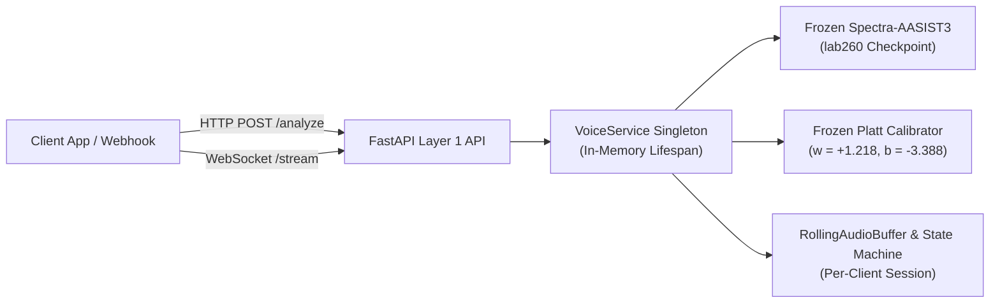

# VERA Layer 1: Voice Authenticity API Reference

**Target Model:** `lab260/Spectra-AASIST3` (Pretrained Checkpoint — **100% Frozen & Unchanged**)  
**Calibration Config:** `calibration/config.json` (Platt Parameters: $w = +1.218015, b = -3.388055$)  
**Calibrated Boundary:** $s^* = +2.781620$ ($P=0.50$, Spoof Signal $= 50.0$)  
**Framework:** FastAPI 0.116+ / Pydantic v2 / Uvicorn  
**Date:** September 2026  

---

## 1. Executive Summary & Architecture

The **VERA Layer 1 Voice Authenticity API** provides real-time REST and WebSocket endpoints for evaluating speech authenticity against synthetic deepfakes, voice clones, and acoustic conversion attacks.



### Architectural Guarantees:
- **Zero Model Modification:** `lab260/Spectra-AASIST3` weights, architecture, and preprocessing are strictly frozen.
- **Single Startup Preload:** The neural network checkpoint is loaded into memory once at application startup via FastAPI's `lifespan` handler and reused across all requests.
- **Zero Raw Audio Persistence:** Audio is processed entirely in RAM buffers and discarded upon inference completion; no biometric audio is written to disk.
- **Per-Client Stream Isolation:** Every WebSocket client connection instantiates an isolated `StreamingSession` with independent buffer and debounce states.

---

## 2. API Endpoints

### Endpoint 1: Health & Readiness Check
- **Route:** `GET /api/v1/voice/health`
- **Method:** `GET`
- **Authentication:** Public / Internal Gateway
- **Description:** Returns operational readiness, active model identification, and frozen calibration thresholds.

#### Response Example (`200 OK`):
```json
{
  "status": "healthy",
  "model_loaded": true,
  "calibration_loaded": true,
  "model_name": "lab260/Spectra-AASIST3",
  "api_version": "1.0.0",
  "calibrated_boundary": 2.78162,
  "operational_spoof_threshold": 50.0
}
```

---

### Endpoint 2: Single-Audio Authenticity Analysis
- **Route:** `POST /api/v1/voice/analyze`
- **Method:** `POST`
- **Content-Type:** `multipart/form-data`
- **Payload:** `file` (WAV or FLAC audio file, maximum 25 MB)
- **Description:** Evaluates an uploaded audio recording against the frozen model and returns structured calibrated probabilities, integrity scores, and decision confidence.

#### Request Example (cURL):
```bash
curl -X POST "http://127.0.0.1:8000/api/v1/voice/analyze" \
     -H "Accept: application/json" \
     -F "file=@sample_call.wav;type=audio/wav"
```

#### Response Example (`200 OK`):
```json
{
  "request_id": "9b1deb4d-3b7d-4bad-9bdd-2b0d7b3dcb6d",
  "model": "lab260/Spectra-AASIST3",
  "raw_bona_fide_logit": 13.5675,
  "calibrated_bona_fide_probability": 0.999992,
  "calibrated_spoof_probability": 0.000008,
  "voice_integrity_score": 99.99,
  "spoof_signal": 0.01,
  "decision_confidence": 0.9998,
  "classification": "BONAFIDE",
  "timestamp": "2026-09-03T12:20:00.000000Z",
  "duration_seconds": 4.5,
  "processing_latency_ms": 785.4
}
```

#### Metric Definitions:
- `raw_bona_fide_logit`: Unbounded real-valued logit from the frozen transformer (higher = more genuine).
- `voice_integrity_score`: Calibrated posterior probability $\hat{P}(\text{Bona Fide} \mid s) \times 100.0$ (Scale: 0–100, where 100 = confirmed genuine human).
- `spoof_signal`: Calibrated spoof signal $(1.0 - \hat{P}(\text{Bona Fide})) \times 100.0$ (Scale: 0–100, where 100 = confirmed synthetic deepfake).
- `decision_confidence`: Normalized distance from the 0.5 decision boundary: $2 \times |P - 0.5| \in [0.0, 1.0]$.
- `classification`: `BONAFIDE` if `spoof_signal < 50.0`, otherwise `SPOOF`.

---

### Endpoint 3: Real-Time Audio Streaming WebSocket
- **Route:** `ws://127.0.0.1:8000/api/v1/voice/stream`
- **Protocol:** WebSocket (Binary Audio Frames & JSON Control Messages)
- **Description:** Ingests live audio packets (16-kHz mono PCM or audio chunks) and emits sliding evaluation events as 64,600-sample windows (~4.04s) complete.

#### Client-to-Server Messages:
1. **Binary Audio Chunks:** Raw 16-bit signed integer PCM or 32-bit float audio bytes (e.g. 100ms–500ms chunks).
2. **Text Control Frames:**
   - `{"action": "flush"}`: Evaluates any residual unconsumed audio into a final window.
   - `{"action": "reset"}`: Clears internal buffers and resets smoothing history.
   - `{"action": "close"}`: Flushes buffer and gracefully terminates connection.

#### Server-to-Client Event Stream:
Whenever a 64,600-sample sliding window completes (every 1.0-second hop), the server emits a JSON `voice_authenticity` event:
```json
{
  "event": "voice_authenticity",
  "request_id": "c73a791a-72f1-477d-9486-277a064a30e8",
  "window_id": 0,
  "timestamp_start": 0.0,
  "timestamp_end": 4.0375,
  "raw_logit": 12.5412,
  "p_bonafide": 0.999824,
  "p_spoof": 0.000176,
  "voice_integrity_score": 99.98,
  "spoof_signal": 0.02,
  "smoothed_spoof_signal": 0.02,
  "confidence": 0.9996,
  "state": "BONAFIDE",
  "is_alert": false,
  "latency_ms": 794.2
}
```

#### Operational States:
- `BONAFIDE`: Smoothed Spoof Signal $< 35.0$ (Genuine human speech).
- `SUSPICIOUS`: $35.0 \le \text{Smoothed Spoof Signal} < 65.0$ (Borderline / acoustic noise).
- `SPOOF`: Smoothed Spoof Signal $\ge 65.0$ (Confirmed synthetic / cloned audio).
- `is_alert`: Set to `true` when `state == "SPOOF"`.

---

## 3. Error Handling & HTTP Status Codes

| Status Code | Meaning | Cause |
|---|---|---|
| `200 OK` | Success | Audio analyzed or health status returned. |
| `400 Bad Request` | Invalid Input | Empty audio file, corrupt WAV/FLAC header, or malformed JSON control message. |
| `413 Payload Too Large` | Limit Exceeded | Uploaded audio file exceeds maximum limit of 25 MB. |
| `415 Unsupported Media Type`| Format Rejected | Uploaded file extension is not supported (supported: `.wav`, `.flac`, `.ogg`). |
| `500 Internal Server Error` | Inference Failure | Internal tensor or computation failure. |
| `503 Service Unavailable` | Service Not Ready| Model or calibration parameters failed to load at startup. |

---

## 4. Concurrency & Threading Model

1. **In-Memory Model Singleton:** PyTorch weights and transformer layers are instantiated once at server startup.
2. **CPU Forward Pass Serialization:** In multi-client deployments, PyTorch CPU matrix multiplications can saturate CPU cores. An internal `asyncio.Lock` synchronizes forward passes across concurrent requests, running via `asyncio.to_thread` without blocking the async event loop.
3. **Parallel Buffer Slicing:** Audio chunk ingestion, preprocessing, buffer management, smoothing, and WebSocket I/O remain fully concurrent across hundreds of client sessions.

---

## 5. Security & Privacy Guarantees

- **No Disk Logging:** Audio waveforms are held strictly in ephemeral RAM buffers and released immediately after evaluation.
- **No Path Disclosure:** Error messages and responses do not leak server directory structures.
- **Biometric Minimization:** Only scalar authenticity probabilities and high-level classifications are stored; raw acoustic embeddings are not persisted.
- **Session Duration Limit:** Streaming connections are capped at a configurable maximum of 300 seconds (5 minutes) to prevent abandoned socket resource leakage.

---

## 6. Local Startup Instructions

### 1. Start the Server via Uvicorn:
```bash
uvicorn api.app:app --host 0.0.0.0 --port 8000 --workers 1
```

### 2. Interactive Swagger / OpenAPI Documentation:
Once running, navigate to:
- **Swagger UI:** `http://localhost:8000/docs`
- **ReDoc UI:** `http://localhost:8000/redoc`

### 3. Run the Demo Client:
```bash
# Health check
python scripts/demo_client.py --mode health

# Analyze single audio file
python scripts/demo_client.py --mode analyze --file path/to/sample.wav

# Real-time WebSocket streaming simulation
python scripts/demo_client.py --mode stream --file path/to/sample.wav
```
