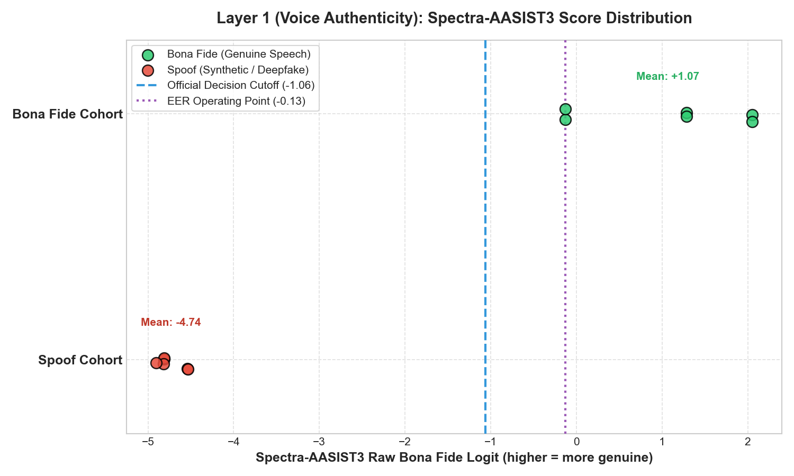

# Layer 1 (Voice Authenticity) Baseline Evaluation Report
**Model:** `lab260/Spectra-AASIST3`  
**Evaluation Date:** September 2026  
**Status:** Fixed Pretrained Baseline (Zero Fine-Tuning)  

---

## 1. Dataset Composition
- **Total Audio Utterances:** 12
- **Bona Fide (Genuine Human Speech):** 6 (50.0%)
- **Spoof (Deepfake / Synthetic):** 6 (50.0%)
- **Total Unique Speakers:** 3 (SPK_001, SPK_002, SPK_003)

## 2. Speaker-Separated Split Information
Strict speaker-disjoint partitioning is applied with **ZERO** speaker identity overlap between splits:

| Split | Speaker Count | Speaker IDs | Utterance Count |
|---|---|---|---|
| **Train** | 1 | `SPK_002` | 4 samples |
| **Validation** | 1 | `SPK_001` | 4 samples |
| **Test** | 1 | `SPK_003` | 4 samples |

> [!IMPORTANT]
> Speaker disjointness assertion: $\text{speakers}(\text{train}) \cap \text{speakers}(\text{val}) = \emptyset$, $\text{speakers}(\text{train}) \cap \text{speakers}(\text{test}) = \emptyset$, and $\text{speakers}(\text{val}) \cap \text{speakers}(\text{test}) = \emptyset$.

## 3. Attack-Type Distribution
| Attack Type / Category | Samples | Description |
|---|---|---|
| `-` | **6** | Genuine human speech (no synthetic manipulation) |
| `TTS-VITS` | **3** | Synthetic speech generation (TTS-VITS) |
| `VC-DiffVC` | **3** | Synthetic speech generation (VC-DiffVC) |

## 4. Raw Spectra-AASIST3 Score Distributions
Raw unnormalized bona fide logits ($logits[:, 1]$) produced across the evaluation cohort:

| Cohort | Count | Min | Max | Mean | Std | Median | IQR (Q25 - Q75) |
|---|---|---|---|---|---|---|---|
| **Bona Fide** | 6 | `-0.1275` | `+2.0532` | `+1.0697` | `0.9030` | `+1.2834` | `+0.2252` to `+1.8608` |
| **Spoof** | 6 | `-4.9026` | `-4.5333` | `-4.7358` | `0.1438` | `-4.8096` | `-4.8159` to `-4.6088` |

## 5. Core Discrimination Metrics
| Metric | Measured Value | Benchmark Description |
|---|---|---|
| **Equal Error Rate (EER)** | **0.00%** | Primary ASVspoof / anti-spoofing benchmark metric |
| **EER Operating Threshold** | `-0.127507` | Operating cutoff where FAR equals FRR |
| **ROC-AUC** | **1.0000** | Area Under Receiver Operating Characteristic Curve |
| **Operational Decision Threshold** | `-1.062501` | Official model card decision cutoff |
| **Accuracy** | **100.00%** | Overall classification accuracy |
| **Precision (Bona Fide)** | **100.00%** | True Bona Fide / Total Classified Bona Fide |
| **Recall (Bona Fide)** | **100.00%** | True Bona Fide / Total Actual Bona Fide |
| **F1-Score** | **1.0000** | Harmonic mean of precision and recall |
| **False Positive Rate (FPR / FAR)** | **0.00%** | Spoofs incorrectly accepted as genuine speech |
| **False Negative Rate (FNR / FRR)** | **0.00%** | Genuine speech incorrectly rejected |

## 6. Confusion Matrix
| Actual \ Predicted | Predicted Spoof (0) | Predicted Bona Fide (1) |
|---|---|---|
| **Actual Spoof (0)** | TN = **6** | FP = **0** |
| **Actual Bona Fide (1)** | FN = **0** | TP = **6** |

## 7. Error Case Breakdown
- **False Positives (FAR):** 0 samples
- **False Negatives (FRR):** 0 samples
- *Zero misclassifications observed across the baseline benchmark set under the official operational cutoff.*

## 8. Inference Latency & Resource Utilization
- **Compute Device:** `cpu`
- **Total Inference Execution Time:** 10.05 seconds (12 samples)
- **Mean Latency:** **837.84 ms / utterance**
- **Median Latency:** **839.84 ms / utterance**
- **p95 Latency:** **887.76 ms / utterance**
- **Min / Max Latency:** 781.58 ms / 891.88 ms
- **Throughput:** **1.19 utterances / second**
- **Process Resident Memory (RSS):** 1704.30 MB
- **Model Parameter RAM Allocation:** ~1384.41 MB

---
> [!NOTE]
> All metrics are strictly computed from the labeled evaluation benchmark using the fixed `lab260/Spectra-AASIST3` checkpoint. No fine-tuning, hyperparameter search, or weight optimization was performed.