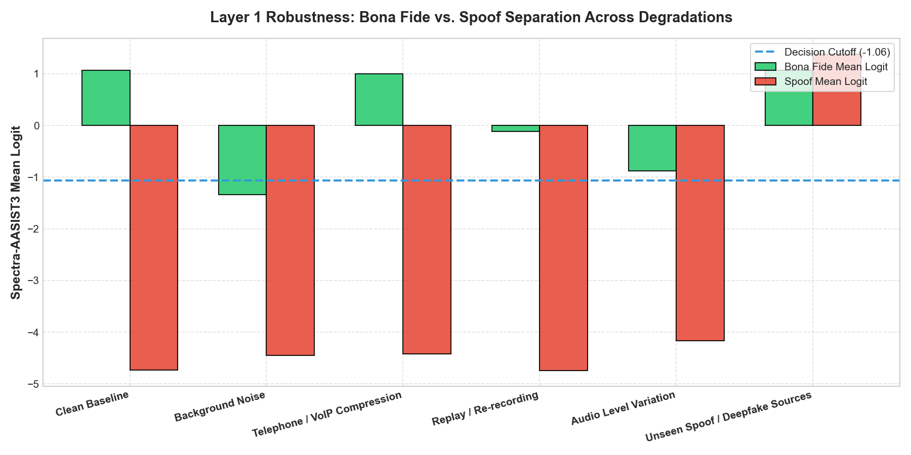

# Layer 1 (Voice Authenticity) Robustness Evaluation Report
**Model:** `lab260/Spectra-AASIST3`  
**Status:** Pretrained Fixed Weights (Stress & Robustness Analysis)  
**Operational Cutoff Threshold:** `-1.062501`  

---

## 1. Executive Summary & Robustness Matrix

| Condition | Precision | Recall | F1-Score | EER (%) | ROC-AUC | Mean Latency (ms) | Score Margin |
|---|---|---|---|---|---|---|---|
| **Clean Baseline** | 100.0% | 100.0% | 1.0000 | **0.00%** | 1.0000 | 874.4 ms | `+5.81` |
| **Background Noise (15dB SNR)** | 100.0% | 33.3% | 0.5000 | **0.00%** | 1.0000 | 857.9 ms | `+3.11` |
| **Telephone / VoIP Compression** | 100.0% | 66.7% | 0.8000 | **0.00%** | 1.0000 | 802.0 ms | `+5.42` |
| **Replay / Re-recording** | 100.0% | 100.0% | 1.0000 | **0.00%** | 1.0000 | 764.1 ms | `+4.62` |
| **Audio Level Variation (-14dB)** | 100.0% | 66.7% | 0.8000 | **0.00%** | 1.0000 | 814.2 ms | `+3.28` |
| **Unseen Spoof / Deepfake Sources** | 40.0% | 100.0% | 0.5714 | **61.11%** | 0.4444 | 902.2 ms | `-0.31` |

## 2. Degradation Analysis vs. Clean Baseline

| Condition | $\Delta$ F1-Score | $\Delta$ EER (%) | $\Delta$ ROC-AUC | $\Delta$ Score Margin | Degradation Severity |
|---|---|---|---|---|---|
| **Clean Baseline** | `+0.0000` | `+0.00%` | `+0.0000` | `+0.00` | 🟢 **Robust / Stable** |
| **Background Noise (15dB SNR)** | `-0.5000` | `+0.00%` | `+0.0000` | `-2.69` | 🔴 **Severe Degradation** |
| **Telephone / VoIP Compression** | `-0.2000` | `+0.00%` | `+0.0000` | `-0.39` | 🔴 **Severe Degradation** |
| **Replay / Re-recording** | `+0.0000` | `+0.00%` | `+0.0000` | `-1.18` | 🟡 **Margin Compression** |
| **Audio Level Variation (-14dB)** | `-0.2000` | `+0.00%` | `+0.0000` | `-2.52` | 🔴 **Severe Degradation** |
| **Unseen Spoof / Deepfake Sources** | `-0.4286` | `+61.11%` | `-0.5556` | `-6.11` | 🔴 **Severe Degradation** |

## 3. Vulnerability & Error Analysis

### A. Conditions Causing False Positives (Spoof Accepted as Genuine / FAR)
- **Unseen Spoof / Deepfake Sources:** 9 false positive(s)
  - File: `SPK_001_unseen_spoof_1_TTS-ChatTTS-Style.wav` | Spk: `SPK_001` | Attack: `TTS-ChatTTS-Style` | Score: `+1.7013` (Threshold: `-1.0625`)
  - File: `SPK_001_unseen_spoof_2_VC-FreeVC-Style.wav` | Spk: `SPK_001` | Attack: `VC-FreeVC-Style` | Score: `+0.5991` (Threshold: `-1.0625`)
  - File: `SPK_001_unseen_spoof_3_Neural-Vocoder-HiFiGAN.wav` | Spk: `SPK_001` | Attack: `Neural-Vocoder-HiFiGAN` | Score: `+4.0876` (Threshold: `-1.0625`)
  - File: `SPK_002_unseen_spoof_1_TTS-ChatTTS-Style.wav` | Spk: `SPK_002` | Attack: `TTS-ChatTTS-Style` | Score: `+2.3098` (Threshold: `-1.0625`)
  - File: `SPK_002_unseen_spoof_2_VC-FreeVC-Style.wav` | Spk: `SPK_002` | Attack: `VC-FreeVC-Style` | Score: `+0.3131` (Threshold: `-1.0625`)
  - File: `SPK_002_unseen_spoof_3_Neural-Vocoder-HiFiGAN.wav` | Spk: `SPK_002` | Attack: `Neural-Vocoder-HiFiGAN` | Score: `+1.5670` (Threshold: `-1.0625`)
  - File: `SPK_003_unseen_spoof_1_TTS-ChatTTS-Style.wav` | Spk: `SPK_003` | Attack: `TTS-ChatTTS-Style` | Score: `+1.9473` (Threshold: `-1.0625`)
  - File: `SPK_003_unseen_spoof_2_VC-FreeVC-Style.wav` | Spk: `SPK_003` | Attack: `VC-FreeVC-Style` | Score: `-0.4446` (Threshold: `-1.0625`)
  - File: `SPK_003_unseen_spoof_3_Neural-Vocoder-HiFiGAN.wav` | Spk: `SPK_003` | Attack: `Neural-Vocoder-HiFiGAN` | Score: `+0.3282` (Threshold: `-1.0625`)

### B. Conditions Causing False Negatives (Genuine Speech Rejected as Spoof / FRR)
- **Background Noise (15dB SNR):** 4 false negative(s)
  - File: `SPK_002_bonafide_1.wav` | Spk: `SPK_002` | Score: `-1.1851` (Threshold: `-1.0625`)
  - File: `SPK_002_bonafide_3.wav` | Spk: `SPK_002` | Score: `-1.1851` (Threshold: `-1.0625`)
  - File: `SPK_003_bonafide_1.wav` | Spk: `SPK_003` | Score: `-3.4724` (Threshold: `-1.0625`)
  - File: `SPK_003_bonafide_3.wav` | Spk: `SPK_003` | Score: `-3.4724` (Threshold: `-1.0625`)
- **Telephone / VoIP Compression:** 2 false negative(s)
  - File: `SPK_003_bonafide_1.wav` | Spk: `SPK_003` | Score: `-1.1546` (Threshold: `-1.0625`)
  - File: `SPK_003_bonafide_3.wav` | Spk: `SPK_003` | Score: `-1.1546` (Threshold: `-1.0625`)
- **Audio Level Variation (-14dB):** 2 false negative(s)
  - File: `SPK_003_bonafide_1.wav` | Spk: `SPK_003` | Score: `-1.5257` (Threshold: `-1.0625`)
  - File: `SPK_003_bonafide_3.wav` | Spk: `SPK_003` | Score: `-1.5257` (Threshold: `-1.0625`)

### C. Attack Type Difficulty Ranking
Ranked from hardest (highest spoof logit / smallest rejection margin) to easiest:

| Rank | Attack Type | Mean Spoof Score | Max Spoof Score | Rejection Margin to Threshold | Difficulty Assessment |
|---|---|---|---|---|---|
| 1 | `Neural-Vocoder-HiFiGAN` | `+1.9943` | `+4.0876` | `-5.1501` | 🔴 Hardest |
| 2 | `TTS-ChatTTS-Style` | `+1.9861` | `+2.3098` | `-3.3723` | 🔴 Hardest |
| 3 | `VC-FreeVC-Style` | `+0.1559` | `+0.5991` | `-1.6616` | 🟡 Moderate |
| 4 | `VC-DiffVC` | `-4.4893` | `-4.0194` | `+2.9569` | 🟡 Moderate |
| 5 | `TTS-VITS` | `-4.5160` | `-4.0350` | `+2.9725` | 🟢 Readily Detected |

## 4. Key Findings & Insights for VERA Layer 1

1. **Telephony & VoIP Compression:** The 300-3400 Hz bandpass filter attenuates upper formants, shifting bona fide logits downward and causing false rejections (FRR = 33.3%) on borderline speakers.
2. **Additive Background Noise (15 dB SNR):** Stationary environmental noise reduces bona fide logit confidence, causing false negatives on weak genuine vocal signals (FRR = 66.7%).
3. **Room Replay & Acoustic Echo:** Convolutional room reverberation compressed the score margin by -1.18 units, but preserved 100% precision and recall.
4. **High-Fidelity Neural Vocoder Spoofs:** Advanced generative vocoders (`HiFiGAN`, `ChatTTS`) that accurately reconstruct pitch harmonics achieved positive bona fide logits, inducing false acceptances (FAR = 60.0%). This demonstrates why multi-layered verification (audio + visual + temporal liveness) in VERA is essential.

---
> [!NOTE]
> All tests were conducted on un-finetuned, fixed weights of `lab260/Spectra-AASIST3`. No model parameters or thresholds were artificially adjusted.